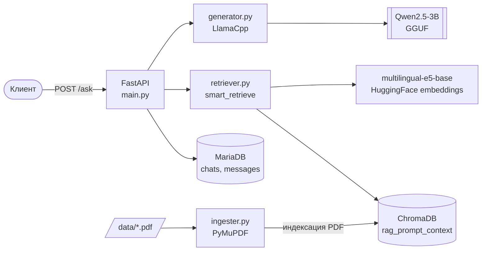

<div align="center">

# 🧠 RAG-консультант по ГОСТ

**Локальный RAG-сервис для ответов на вопросы по нормативным документам (ГОСТ).**
Парсит PDF, строит векторный индекс в ChromaDB и отвечает через локальную LLM — без облаков и внешних API.

[](https://www.python.org/)
[](https://fastapi.tiangolo.com/)
[](https://www.trychroma.com/)
[](https://github.com/abetlen/llama-cpp-python)
[](https://docs.docker.com/compose/)

</div>

---

## 📋 Содержание

- [Возможности](#-возможности)
- [Как это работает](#-как-это-работает)
- [Архитектура](#-архитектура)
- [Технологический стек](#-технологический-стек)
- [Быстрый старт](#-быстрый-старт)
- [Конфигурация (.env)](#-конфигурация-env)
- [Запуск в Docker](#-запуск-в-docker)
- [API](#-api)
- [Структура проекта](#-структура-проекта)
- [Как добавить свои документы](#-как-добавить-свои-документы)
- [Траблшутинг](#-траблшутинг)

---

## ✨ Возможности

- 📄 **Ингест PDF** — парсинг ГОСТ-документов через PyMuPDF, очистка колонтитулов/номеров страниц, разбиение по разделам.
- 🏷️ **Умная разметка** — каждому разделу автоматически присваивается тема (`equipment` / `procedure` / `calculation` / `general`) и метаданные (номер ГОСТ, заголовок, индекс раздела).
- 🔎 **Intent-aware поиск** — запрос классифицируется по намерению, поиск в ChromaDB фильтруется по теме, с fallback на общий поиск.
- 🤖 **Локальная генерация** — ответы формирует LLM (Qwen2.5-3B-Instruct) через `llama-cpp-python` с оффлоадом слоёв на GPU (CUDA) или на CPU.
- 💬 **История чатов** — диалоги и сообщения сохраняются в MariaDB; есть эндпоинты для списка чатов и истории.
- 🐳 **Docker-ready** — отдельные конфигурации для CPU (разработка на macOS) и CUDA-GPU (прод).

---

## 🧩 Как это работает

```
Вопрос пользователя
        │
        ▼
[FastAPI /ask] ──► создаёт/находит чат, пишет сообщение в MariaDB
        │
        ▼
[Retriever] ──► detect_query_intent → similarity_search в ChromaDB (фильтр по topic, k=2)
        │
        ▼
[Prompt builder] ──► собирает контекст + вопрос в шаблон
        │
        ▼
[LLM / LlamaCpp] ──► генерирует краткий ответ (n_gpu_layers=-1)
        │
        ▼
Ответ ◄── сохраняется в MariaDB и возвращается клиенту (answer, chat_id, title)
```

При первом запуске, если каталог `chroma_db/` отсутствует, автоматически запускается индексация документа (`parse_data()`).

---

## 🏗 Архитектура



---

## 🛠 Технологический стек

| Слой | Технология |
|------|-----------|
| API | FastAPI + Uvicorn |
| LLM-рантайм | `llama-cpp-python` (CUDA / CPU), модель Qwen2.5-3B-Instruct `Q4_K_M` (GGUF) |
| Эмбеддинги | `intfloat/multilingual-e5-base` через `langchain-huggingface` |
| Векторное хранилище | ChromaDB (persistent, коллекция `rag_prompt_context`) |
| Парсинг PDF | PyMuPDF (`fitz`) |
| Оркестрация RAG | LangChain (`langchain-core`, `langchain-chroma`, `langchain-huggingface`) |
| Реляционная БД | MariaDB 11 + SQLAlchemy + PyMySQL |
| Инфраструктура | Docker, Docker Compose |

---

## 🚀 Быстрый старт

### Требования

- **Python 3.11+** (проект тестировался на 3.13)
- Файл модели **GGUF** (например, `qwen2.5-3b-instruct-q4_k_m.gguf`)
- Запущенный **MariaDB/MySQL** (локально или через Docker)
- Для GPU-сборки: NVIDIA-драйвер + [NVIDIA Container Toolkit](https://docs.nvidia.com/datacenter/cloud-native/container-toolkit/latest/install-guide.html)

### Установка (локально)

```bash
# 1. Виртуальное окружение
python -m venv venv
source venv/bin/activate          # Windows: venv\Scripts\activate

# 2. Зависимости
pip install -r requirements.txt

# 3. Конфигурация
cp .env.example .env              # затем отредактируйте значения

# 4. (опционально) поднять только БД через Docker
docker compose up -d mariadb

# 5. Запуск API
uvicorn main:app --host 0.0.0.0 --port 8000 --reload
```

После старта документация Swagger доступна на **http://localhost:8000/docs**.

> 💡 При первом запросе подтягивается модель эмбеддингов с HuggingFace и (при отсутствии `chroma_db/`) выполняется индексация PDF — это может занять время.

---

## ⚙️ Конфигурация (.env)

Все настройки читаются в `config/config.py` через `python-dotenv`.

| Переменная | Описание | Пример |
|------------|----------|--------|
| `LLM_PATH` | Путь к локальному файлу модели GGUF | `/models/qwen2.5-3b-instruct-q4_k_m.gguf` |
| `EMBEDDING_MODEL_NAME` | Имя/путь модели эмбеддингов (HuggingFace) | `intfloat/multilingual-e5-base` |
| `DB_HOST` | Хост БД. Локально — `localhost`, **в Docker — `mariadb`** (имя сервиса) | `mariadb` |
| `DB_PORT` | Порт БД внутри сети (контейнер слушает `3306`) | `3306` |
| `DB_USERNAME` | Пользователь БД | `root` |
| `DB_PASSWORD` | Пароль БД | `change-me` |
| `DB_NAME` | Имя базы данных | `mol_consultant_db` |

> ⚠️ **Важно:** при запуске API в Docker укажите `DB_HOST=mariadb` (имя сервиса в сети Compose), а не `localhost`. Снаружи контейнера MariaDB проброшена на порт **3307** (`localhost:3307`).

---

## 🐳 Запуск в Docker

В проекте два compose-файла и два Dockerfile:

| Файл | Назначение | Базовый образ |
|------|-----------|---------------|
| `docker-compose.yml` + `DockerFile_mac` | CPU-сборка (разработка, macOS) | `ubuntu:22.04`, llama.cpp без CUDA |
| `docker-compose.gpu.yml` + `Dockerfile` | GPU-сборка (прод, CUDA) | `nvidia/cuda:12.4.1-devel`, llama.cpp с `-DGGML_CUDA=on` |

### CPU (локальная разработка)

```bash
docker compose up --build
```

### GPU (прод, CUDA)

Требуется хост с NVIDIA-драйвером и установленным NVIDIA Container Toolkit.

```bash
docker compose -f docker-compose.gpu.yml up --build -d
```

GPU пробрасывается через `deploy.resources.reservations.devices`, а переменные `NVIDIA_VISIBLE_DEVICES=all` и `NVIDIA_DRIVER_CAPABILITIES=compute,utility` гарантируют, что CUDA-бэкенд llama.cpp получит доступ к вычислительным capability (без `compute` контейнер видит `nvidia-smi`, но инициализация CUDA падает).

Проверить, что GPU виден внутри контейнера:

```bash
docker exec -it rag_api nvidia-smi
```

---

## 📡 API

Базовый URL: `http://localhost:8000`

### `POST /ask`

Задать вопрос. Если `chat_id` не передан — создаётся новый чат (заголовок = первые 50 символов вопроса).

**Тело запроса**
```json
{
  "prompt": "Какие средства измерений применяются?",
  "chat_id": "optional-uuid"
}
```

**Ответ**
```json
{
  "answer": "…",
  "chat_id": "f1a2…",
  "title": "Какие средства измерений применяются?"
}
```

### `GET /chats`

Список всех чатов (для сайдбара), отсортирован по дате создания (desc).

### `GET /chats/{chat_id}`

История сообщений конкретного чата (asc по времени).

**Пример (curl)**
```bash
curl -X POST http://localhost:8000/ask \
  -H "Content-Type: application/json" \
  -d '{"prompt": "Какое оборудование нужно для измерений?"}'
```

---

## 📁 Структура проекта

```
rag-project/
├── main.py                  # FastAPI-приложение: эндпоинты, lifespan, инициализация
├── database.py              # SQLAlchemy: модели Chat/Message, движок MariaDB
├── config/
│   └── config.py            # Чтение .env, пути (CHROMA_PATH, LLM_PATH …)
├── src/
│   ├── ingester.py          # Парсинг PDF (PyMuPDF), разбиение по разделам, индексация в Chroma
│   ├── retriever.py         # Ретривер Chroma + intent-aware smart_retrieve
│   ├── generator.py         # LlamaCpp + шаблон промпта
│   ├── utils.py             # HuggingFace-эмбеддинги
│   └── test_ingester.py     # Тесты ингестора
├── data/                    # Исходные PDF (ГОСТ)
├── models/                  # Файлы моделей GGUF (gitignored)
├── chroma_db/               # Персистентный индекс ChromaDB (создаётся автоматически)
├── Dockerfile               # CUDA/GPU образ
├── DockerFile_mac           # CPU образ
├── docker-compose.yml       # CPU стек (API + MariaDB)
├── docker-compose.gpu.yml   # GPU стек (API + MariaDB)
└── requirements.txt
```

---

## 📥 Как добавить свои документы

1. Положите PDF в каталог `data/`.
2. Укажите путь к файлу в `parse_data()` (`src/ingester.py`) — сейчас он зашит как `data/4293750815.pdf`.
3. Удалите старый индекс и переиндексируйте:

```bash
rm -rf chroma_db
python -m src.ingester
```

> Логика разбиения (`split_top_sections`) и классификации тем (`detect_topic`) рассчитана на структуру ГОСТ (нумерованные разделы). Для документов другого формата может потребоваться адаптация регулярных выражений в `ingester.py`.

---

## 🩺 Траблшутинг

| Симптом | Причина / решение |
|---------|-------------------|
| `Can't connect to MySQL server` в Docker | `DB_HOST` должен быть `mariadb`, а не `localhost`; убедитесь, что сервис `mariadb` здоров (healthcheck). |
| GPU не используется, llama.cpp падает на загрузке модели | Проверьте `nvidia-smi` в контейнере; нужны `NVIDIA_DRIVER_CAPABILITIES=compute,utility` и установленный NVIDIA Container Toolkit. |
| `could not select device driver "nvidia"` | На хосте не настроен NVIDIA Container Toolkit / runtime. |
| Долгий первый запуск | Скачивание модели эмбеддингов с HuggingFace + индексация PDF. Последующие старты быстрее. |
| Пустой/нерелевантный ответ | Проверьте, что `chroma_db/` наполнен (`Indexed N sections` в логах ингеста) и эмбеддинг-модель совпадает с использованной при индексации. |

---

<div align="center">

Сделано с ❤️ для офлайн-RAG по нормативным документам.

</div>
